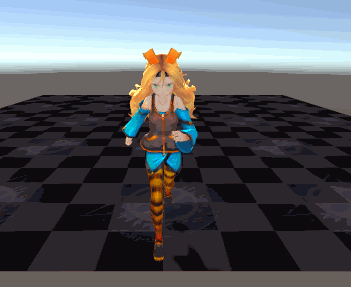
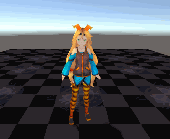
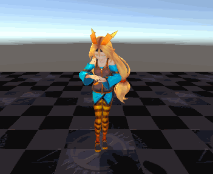

# ChanControl
Unity Experiment: making animators and writing scripts to make a human model walk, run, jump, slide, strecth and idle.

It's a simple test.

The necessary assets is under the 'assets' folder, which already has scripts and controller, but I wrote a new a 
animators and script for studying purposes.

## How to control the model

w:for moving forwards

s:for moving backwards

a:for turning left

d:for turning right

u:change to running

space: for sliding, only in running state.

j:for jumping

h:for strecthing

